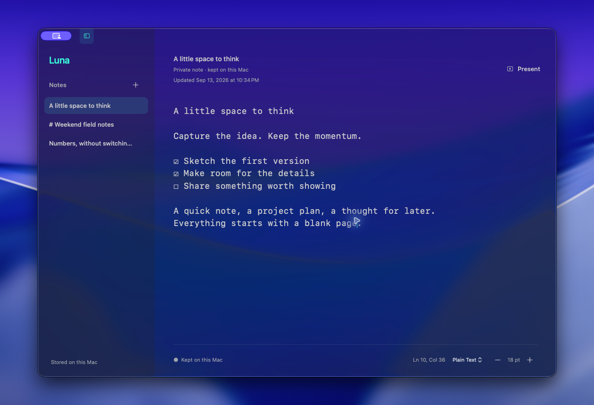
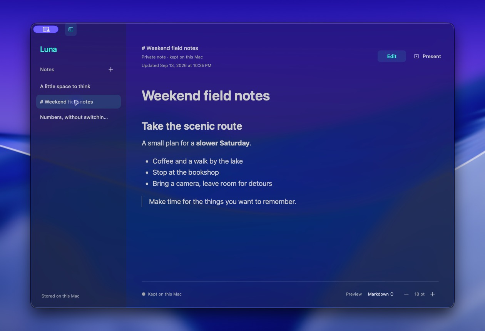
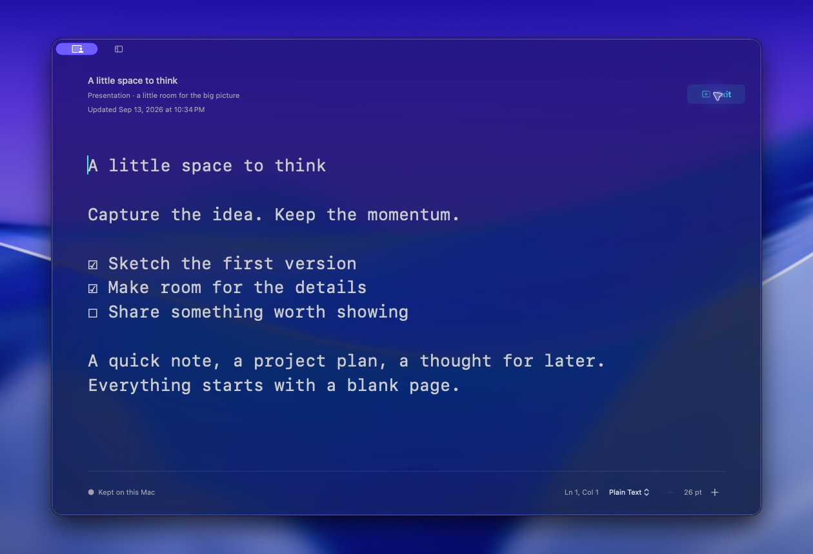

<h1 align="center">Luna</h1>

<p align="center"><strong>A little space to think.</strong><br>A native Mac app for quick notes, everyday files, and ideas worth putting on screen.</p>

<p align="center"><a href="https://github.com/elishaterada/luna/releases/latest">Download Luna</a> · <a href="docs/user-guide.md">User guide</a> · <a href="CHANGELOG.md">What’s new</a></p>



An idea arrives before it has a filename. A plan needs a few numbers. A conversation needs a page everyone can read. Luna gives you a comfortable place for all three—and opens the text files you already work with.

## Why Luna?

- **Start writing immediately.** Press ⌘N and capture the thought. Scratch notes recover when you close the window or quit, so you can return to them later without choosing a filename first.
- **Keep notes and real files together.** Open Markdown, text, CSV, JSON, configuration files, and source code from Finder or the `luna` command. Edit an existing file and save back to its original location when you’re ready.
- **Work out the numbers where you’re thinking.** Type an expression ending in `=` and press Tab to accept the answer. Use percentages, named values, unit conversions, time totals, and date math in the same note.
- **Turn a note into something you can show.** Presentation mode hides the notes shelf and enlarges the text. Bring a meeting agenda, explanation, or live sketch into focus with ⌘⇧P.
- **Give ideas more than words.** Preview Markdown, check off tasks, and add local images, audio, or video. Choose how pasted links appear, from plain text to live embeds.
- **Make the space yours.** Choose fonts, spacing, light or dark appearance, and photo or video skins. Optional typing sounds and visual effects add a little personality.
- **Feel at home on the Mac.** Built with AppKit and TextKit 2, with native find and replace, undo, keyboard shortcuts, and macOS window materials.

## Write, then read beautifully

Keep the source close and switch to a formatted Markdown preview with ⌘⇧M. Headings, lists, quotes, tables, and code blocks become easy to scan; task checkboxes can update the source directly.



## Make room for the big picture

One shortcut turns your working note into a larger, cleaner view for a conversation or screen share. Exit presentation mode to return to your previous notes-shelf setting.



*Actual Luna 0.7.0 screenshots on macOS, captured against the desktop wallpaper with sample notes in a separate workspace and padding around each window. Window materials vary with your system and accessibility settings.*

## How Luna compares

Luna is a good fit when you want a personal Mac scratchpad that also edits ordinary files. Here’s where it fits alongside other note apps:

| App | A strong fit for | Why you might choose Luna instead |
| --- | --- | --- |
| **Apple Notes** | Built-in Apple-device notes, shared notes, attachments, audio transcription, and Math Notes. | You want to open and save existing text or code files, use syntax colors, and put a note into presentation mode. |
| **Bear** | Native Markdown writing on Mac, iPhone, and iPad, tag-based organization, and iCloud sync with Bear Pro. | You want scratch notes alongside files opened directly from Finder or the terminal, plus inline calculations and photo/video backgrounds. |
| **Obsidian** | A local Markdown knowledge base with backlinks, graph views, Canvas, and an extensive plugin ecosystem. | You want a small notes shelf for immediate writing and individual file edits, without setting up a vault or choosing plugins. |
| **Notion** | Shared documents, wikis, databases, and collaborative team workspaces. | You want a personal native Mac editor for local notes and files, with no account needed to start writing. |

These are workflow tradeoffs, not speed benchmarks or an exhaustive feature checklist. Apple Notes also solves inline math; Bear is also native; Obsidian also keeps notes locally. Luna brings its particular mix of scratch notes, file editing, calculations, and presentation into one app.

Competitor features checked September 13, 2026 against the official [Apple Notes guide](https://support.apple.com/guide/notes/welcome/mac), [Bear features](https://bear.app/), [Obsidian overview](https://obsidian.md/) and [core plugins](https://obsidian.md/help/plugins), and [Notion notes and docs](https://www.notion.com/notes). Features and plan availability can change.

**Know the fit:** Luna is currently Mac-only, with no built-in cloud sync, real-time collaboration, backlink graph, or plugin system. Choose it for your own writing and file work on a Mac; the alternatives above offer broader organization or sharing workflows.

## Your work stays close

Notes and recovery copies live on your Mac. Opening and editing a file does not silently overwrite the original: use **Save** when you’re ready. Scratch notes can become ordinary files with **Save As File**. Media-note exports include a sibling assets folder to keep with the Markdown file.

Recovery is local plaintext, not an encrypted vault or a backup service. Markdown preview renders locally without loading external images. Link previews and live embeds contact their websites; optional online currency conversion contacts a rate service and starts off disabled. Automatic update checks contact the release service. See the [user guide](docs/user-guide.md#your-notes-and-files) for recovery and saving details.

## Get Luna

Requires **macOS 14 or newer**.

1. Download the latest build from [GitHub Releases](https://github.com/elishaterada/luna/releases/latest).
2. Move **Luna.app** into **Applications** and follow the release page’s first-open instructions.
3. Open Luna and press **⌘N**. Your next note is ready.

Current preview builds are ad-hoc signed and are **not Apple-notarized**. Subsequent updates use signed Sparkle updates; choose **Luna → Check for Updates…** to check manually.

| Do this | Shortcut |
| --- | --- |
| New note | ⌘N |
| Open a file | ⌘O |
| Save | ⌘S |
| Find and replace | ⌘F |
| Preview / source / live view | ⌘⇧M |
| Presentation mode | ⌘⇧P |

For terminal access, enable the **luna command** in **Settings → Command Line**, then open a new terminal tab:

```sh
luna notes.txt README.md config.yaml
```

## Build and explore

Building requires Xcode 26’s command-line tools and Swift 6. Run these commands from the repository root:

```sh
./Scripts/build.sh
open dist/Luna.app
```

Run tests with `swift test`, or open `Package.swift` in Xcode.

Read the [full user guide](docs/user-guide.md) for calculations, media, skins, shortcuts, and file handling. For development, see [measured performance](docs/performance.md), [design notes](docs/design-cohesion.md), [implementation history](docs/llm-changelog.md), and the [release runbook](docs/releasing.md).
